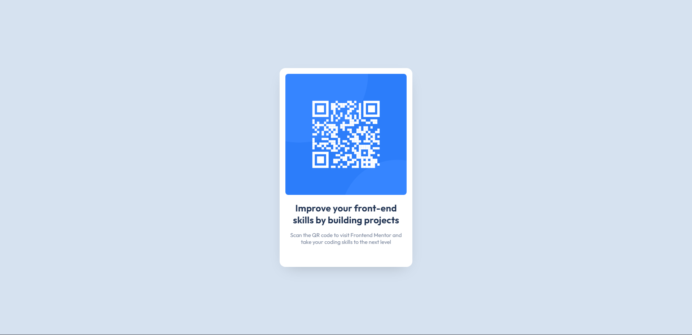

# Frontend Mentor - QR code component

# Frontend Mentor - QR code component solution

This is a solution to the [QR code component challenge on Frontend Mentor](https://www.frontendmentor.io/challenges/qr-code-component-iux_sIO_H).

### Screenshot

### Links

- Live Site URL: [here](https://qr-code-component-main-theta.vercel.app/)

### Built with

- Semantic HTML5 markup
- CSS custom properties

### What I learned

I still don't know how to properly centering image inside of the parent element, might have to learn more about that. Using chrome dev tool to make changes live is really helpfull.

### Useful resources

(https://www.youtube.com/watch?v=jx5jmI0UlXU) - This helped me centering the card using.
(https://box-shadow.dev/) - Helped me generating box shadow

## Author

- Frontend Mentor - [@bakainu](https://www.frontendmentor.io/profile/bakainu)
